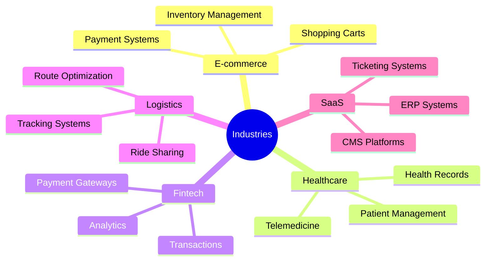

<div align="center">

# 👋 Hello, I'm Nadia Tabassum

### Senior Software Engineer | Full Stack Developer| React, NextJs, React Native, NodeJs


</div>

<div align="center">
  
[](https://www.upwork.com/freelancers/~013cc71063b6d9a7af?mp_source=share)
[](https://www.upwork.com/freelancers/~013cc71063b6d9a7af?mp_source=share)
[]()

</div>

---

<div align="center">

## About Me

</div>

```typescript
const nadia = {
    role: "Senior Software Engineer",
    location: "🌍 Working Globally",
    experience: "5+ years",
    freelancing: "Since 2023",
    
    currentFocus: [
        "Building scalable real-time applications",
        "Architecting cloud-native solutions",
        "Delivering exceptional client experiences"
    ],
    
    philosophy: "Clean code, solid engineering, and client success first 🎯"
};
```

<div align="center">

### I transform ideas into production-ready applications

**From Figma designs to deployed solutions** | **Real-time systems** | **Mobile & Web**

</div>

---

<div align="center">

## Technology Arsenal

</div>

<div align="center">

### Frontend Mastery


### Backend & Database


### Styling & UI Frameworks


### Cloud & DevOps


</div>

---

<div align="center">

## What I Deliver

<table align="center" style="margin: auto;">
<tr>
<td width="50%" valign="top">

### Frontend Excellence
- Pixel-perfect Figma → Code conversion
- Cross-platform mobile apps (iOS & Android)
- High-performance web applications
- Stunning UI/UX implementations
- Real-time interactive features

</td>
<td width="50%" valign="top">

### Backend & Infrastructure
- Scalable REST & GraphQL APIs
- AWS/Cloud architecture setup
- Authentication & authorization (SSO, JWT, OAuth)
- Payment gateway integration (Stripe, RazorPay)
- Real-time chat (Socket.io, Firebase, Twilio)

</td>
</tr>
<tr>
<td width="50%" valign="top">

### Location & Maps
- Google Maps integration
- GPS & geolocation tracking
- Real-time location services
- Location-based features

</td>
<td width="50%" valign="top">

### Deployment & More
- CI/CD pipeline setup
- Google Play Store deployment
- Push notifications
- Complex bug fixing & refactoring
- Data scraping & automation

</td>
</tr>
</table>

</div>


---

<div align="center">

## GitHub Performance

</div>

<div align="center">


</div>

---

<div align="center">

## Upwork Excellence

</div>

<div align="center">

### ⭐ Top Rated Plus Freelancer ⭐

<a href="https://www.upwork.com/freelancers/~013cc71063b6d9a7af?mp_source=share">
  
</a>

<br><br>

| Metric | Value |
|-----------|----------|
| **Job Success Score** | 100% |
| **Total Hours** | 1000+ |
| **Client Rating** | ⭐⭐⭐⭐⭐ (5.0 Consistent) |
| **Long-term Clients** | 🤝 Multiple ongoing partnerships |

<br>

**🌟 Trusted by clients worldwide for delivering reliable, scalable, and high-quality solutions 🌟**

<br>

[](https://www.upwork.com/freelancers/~013cc71063b6d9a7af?mp_source=share)

</div>

---

<div align="center">

## Client Testimonials

</div>

<div align="center">

### What Clients Say About Working With Me

<br>

<div align="center">

<table>
  <tr>
    <td align="center" width="50%">
      
    </td>
    <td align="center" width="50%">
      
    </td>
  </tr>
  <tr>
    <td align="center" width="50%">
      
    </td>
    <td align="center" width="50%">
      
    </td>
  </tr>
</table>

</div>


<br>

**✨ Consistent 5-star reviews across all projects ✨**

<br>

[](https://www.upwork.com/freelancers/~013cc71063b6d9a7af?mp_source=share)

</div>

---

<div align="center">

## Industry Experience

</div>

<div align="center">



</div>

---

<div align="center">

## Let's Connect

</div>

<div align="center">

### Get in touch with me!

<br>

[](https://linkedin.com/in/yourprofile)
[](https://yourportfolio.com)
[](mailto:youremail@gmail.com)
[](https://www.upwork.com/freelancers/~013cc71063b6d9a7af?mp_source=share)

<br>

### 💡 Open for:
🚀 Freelance Projects | 🤝 Long-term Collaborations | 💼 Consulting

<br>

---


**⭐ If you find my work interesting, feel free to star my repositories! ⭐**


</div>
